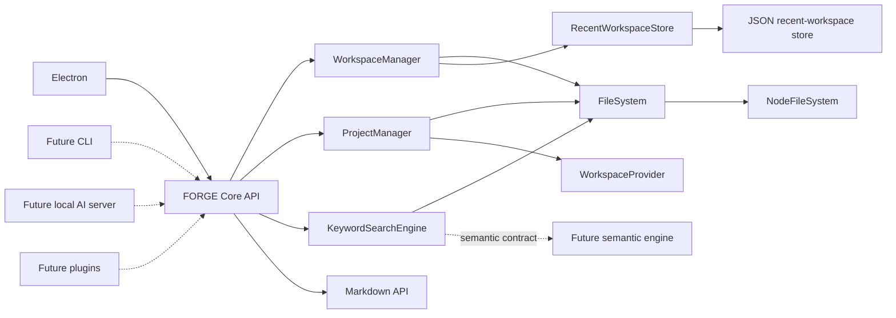

# 🧩 FORGE Core Architecture

`@forge/core` is the runtime-independent foundation package for FORGE. The current desktop runtime composes `@forge/workspace`, `@forge/storage`, and related services directly; `@forge/core` defines a reusable boundary that Electron, a future CLI, a local AI server, or plugins can consume without inheriting UI, IPC, packaging, or process-wide global state.

## 🗂️ Folder layout

```text
packages/core/
├── filesystem/
│   └── index.ts       # Promise-based filesystem contract and Node implementation
├── markdown/
│   └── index.ts       # Markdown parsing, links, backlinks, front matter, metadata
├── project/
│   └── index.ts       # project.json schema and ProjectManager
├── search/
│   └── index.ts       # KeywordSearchEngine and semantic-search contracts
├── workspace/
│   └── index.ts       # WorkspaceManager and recent-workspace stores
├── src/
│   └── index.ts       # Public exports and dependency composition root
├── test/              # Focused tests for every core subsystem
├── package.json       # @forge/core package and subpath exports
└── tsconfig.json      # Isolated strict type-check configuration
```

The public package supports both the unified `@forge/core` import and focused subpath imports such as `@forge/core/filesystem` and `@forge/core/search`.

## 🎯 Responsibilities

### Filesystem

`FileSystem` defines the storage operations required by the rest of core. Every operation is promise-based. `NodeFileSystem` provides the production Node.js implementation, including atomic writes, exclusive file creation, cross-device moves, directory enumeration, and an async directory-watcher abstraction.

The required public operations are:

- `readFile()`
- `writeFile()`
- `createFile()`
- `deleteFile()`
- `moveFile()`
- `renameFile()`
- `watchDirectory()`
- `listDirectory()`

The contract also exposes the minimal directory and path inspection operations needed by higher layers. Managers depend on the interface, not the Node implementation.

### Workspace

`WorkspaceManager` owns the active-workspace lifecycle. Opening an existing directory creates and verifies the required structure:

```text
.workspace/
.vault/
.notes/
.projects/
.cache/
.settings/
```

The manager exposes `openWorkspace()`, `closeWorkspace()`, `currentWorkspace()`, `listRecentWorkspaces()`, and `validateWorkspace()`. Recent-workspace persistence is injected through `RecentWorkspaceStore`; the package includes JSON-backed and in-memory implementations. Returned objects are copied so callers cannot mutate manager state accidentally.

### Markdown

The Markdown module is stateless. It parses Markdown to HTML and a strongly typed document model, supports scalar and list front matter, extracts Markdown/wiki/autolinks with source positions, derives document metadata, and resolves backlinks across a supplied document collection.

Its public functions are `parseMarkdown()`, `extractLinks()`, `extractBacklinks()`, `frontMatter()`, and `metadata()`.

### Search

`KeywordSearchEngine` maintains an in-memory inverted index. It recursively discovers supported text files, excludes generated and dependency directories, records indexing failures without discarding successful files, and ranks matching documents with BM25-style term frequency and document-frequency scoring. Phrase and title matches provide deterministic ranking boosts.

`SearchEngine` is the general keyword contract. `SemanticSearchEngine`, `EmbeddingProvider`, `SemanticDocument`, and semantic query/result types define the future vector-search boundary without coupling core to a model vendor or vector database.

### Projects

`ProjectManager` stores each project at `.projects/<project-id>/project.json`. Schema version 1 contains the stable project identity, name, optional description, active/archive state, tags, timestamps, and JSON-compatible extension metadata.

The manager exposes `loadProject()`, `saveProject()`, `updateProject()`, and `listProjects()`. It validates identifiers and runtime JSON structure, keeps immutable identity/creation fields stable during updates, and uses the filesystem layer's atomic writes.

### Composition root

`createForgeCore()` is the only wiring function. It creates or accepts a filesystem adapter, requires an explicit recent-workspace persistence choice, and constructs workspace, project, and keyword-search services. It returns ordinary object references; it does not cache instances or register globals.

## 🔗 Dependency graph

```text
createForgeCore
├── FileSystem contract
│   └── NodeFileSystem
├── RecentWorkspaceStore
│   ├── JsonRecentWorkspaceStore ──> FileSystem
│   └── InMemoryRecentWorkspaceStore
├── WorkspaceManager ──────────────> FileSystem + RecentWorkspaceStore + Clock
├── ProjectManager ────────────────> FileSystem + WorkspaceProvider + Clock
│                                      WorkspaceManager implements WorkspaceProvider
└── KeywordSearchEngine ───────────> FileSystem + Tokenizer

Markdown functions ────────────────> marked (no manager dependencies)
```

Dependencies point inward to contracts. The filesystem layer imports no other core module; workspace depends only on filesystem; projects depend on filesystem and the workspace contract; search depends only on filesystem. Markdown is independent. This direction prevents circular dependencies.

## 🏗️ Runtime architecture



Solid arrows are implemented dependencies. Dashed arrows are contract-defined extension points.

## 🔭 Future extension points

- Add filesystem adapters for sandboxed plugin access, remote stores, or encrypted vault content without changing managers.
- Add a platform-specific recent-workspace store while retaining the same `WorkspaceManager` API.
- Implement `SemanticSearchEngine` with an injected `EmbeddingProvider`, then combine keyword and semantic results in a separate hybrid-search coordinator.
- Add project schema migrations by mapping older `schemaVersion` values to the current runtime model before validation.
- Add indexing persistence behind a new index-store contract when startup performance requires retaining the inverted index.
- Add Electron IPC, CLI command, local-server, and plugin adapters outside core. Those adapters translate transport input into core calls and keep transport concerns out of this package.
- Add workspace policy services for permissions, encryption, ignore rules, and plugin capability grants through injected contracts rather than manager globals.
